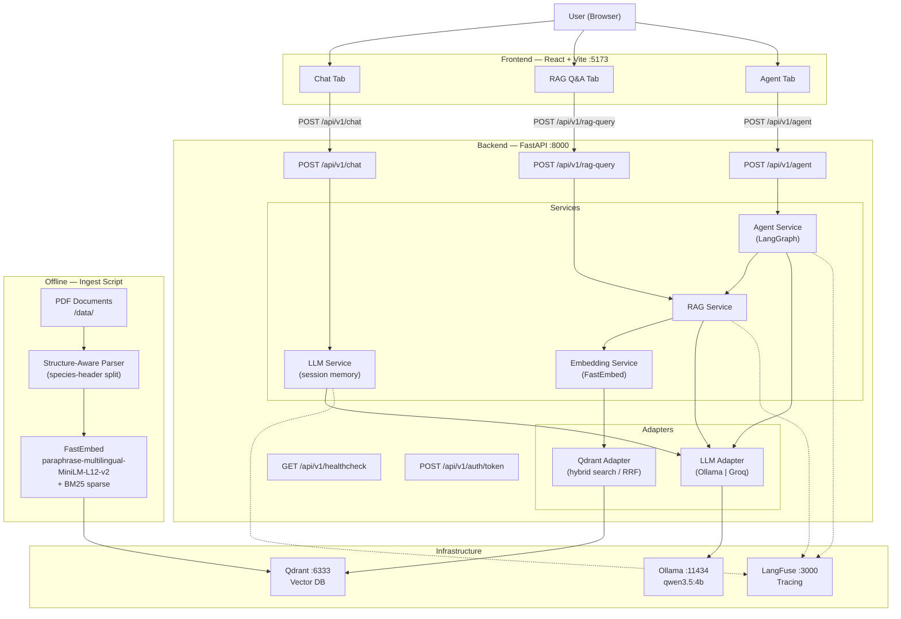

# GenAI Developer Challenge

End-to-end GenAI application with RAG pipeline, LLM integration, and a React frontend.  
Built as a technical challenge to demonstrate GenAI development, API design, and modern ML engineering practices.

---

## Table of Contents

- [Goal](#goal)
- [Architecture](#architecture)
- [Tech Stack](#tech-stack)
- [Prerequisites](#prerequisites)
- [Setup & Run](#setup--run)
  - [Local Development](#local-development)
  - [Docker](#docker)
- [Authentication](#authentication)
- [API Reference](#api-reference)
- [RAG Pipeline](#rag-pipeline)
- [Prompt Engineering](#prompt-engineering)
- [Observability — LangFuse](#observability--langfuse)
- [Configuration](#configuration)
- [Testing](#testing)
- [Cloud Deployment](#cloud-deployment)
- [GenAI Coding Assistants](#genai-coding-assistants)

---

## Goal

Build an end-to-end GenAI application that:

1. Exposes a **REST API** (FastAPI) for LLM-powered chat and document-grounded Q&A.
2. Implements a **RAG pipeline** — ingest PDFs, embed them, store in Qdrant, retrieve relevant context at query time.
3. Adds a **LangGraph agent** that classifies queries, retrieves from the corpus when needed, grades the results, and rewrites the query once if retrieval quality is poor.
4. Provides a **React frontend** with Chat, RAG Q&A, and Agent tabs.
5. Runs entirely on **free/open-source tools** — local Ollama, local Qdrant, open-source embeddings. Groq cloud is available as a zero-cost alternative to Ollama.

---

## Architecture



**Agent graph flow:**

```
classify → "rag"    → retrieve → grade → "good"              → generate_rag   → answer
         → "direct" → generate_direct  → answer
                               → "poor" + retries < 1 → rewrite → retrieve → grade
                               → "poor" + retries ≥ 1 → generate_direct    → answer
```

---

## Tech Stack

| Layer | Tool | Why |
|---|---|---|
| API framework | FastAPI 0.115+ | Async-native, automatic OpenAPI docs, Pydantic-first |
| Runtime | Python 3.12 | Latest stable, full type narrowing support |
| Dependency manager | uv | 10–100× faster than pip, reproducible lock file |
| LLM runtime | Ollama (local) | Zero-cost local inference, OpenAI-compatible API |
| LLM model | qwen3.5:4b | Strong instruction-following at 4B params, fast on CPU/Apple Silicon |
| LLM cloud alt | Groq (free tier) | `llama-3.3-70b-versatile` — ~10× faster than local 4B, no credit card |
| LLM integration | langchain-ollama / langchain-groq | Thin, well-maintained wrappers; swappable via `LLM_PROVIDER` env var |
| Embeddings | FastEmbed `sentence-transformers/paraphrase-multilingual-MiniLM-L12-v2` | ~120 MB model, auto-downloaded, multilingual (Spanish + English), 384 dims |
| Sparse embeddings | FastEmbed `Qdrant/bm25` | BM25 keyword matching for hybrid search |
| Vector DB | Qdrant (local) | Hybrid search, metadata filtering, first-class FastEmbed support |
| Text splitting | langchain-text-splitters | Recursive character splitter with configurable overlap |
| PDF loading | PyMuPDF (`fitz`) | Fast text + image extraction |
| Agent orchestration | LangGraph | Typed state graph with conditional edges and retry loop |
| Observability | LangFuse (self-hosted) | End-to-end prompt/response tracing, session grouping |
| Auth | python-jose + bcrypt | JWT Bearer tokens |
| Validation | Pydantic v2 | Request/response models + settings |
| Frontend | React + Vite + TypeScript + Tailwind | Lightweight, typed, fast HMR |
| Testing | pytest + pytest-asyncio | Async-native unit tests |
| Linting | Ruff | Replaces flake8 + isort + pyupgrade |
| Containerisation | Docker + Compose | One-command local stack |

---

## Prerequisites

| Tool | Install |
|---|---|
| Python 3.12+ | `uv python install 3.12` |
| [uv](https://docs.astral.sh/uv/) | `curl -LsSf https://astral.sh/uv/install.sh \| sh` |
| [Docker Desktop](https://www.docker.com/products/docker-desktop/) | Download from Docker website |
| [Ollama](https://ollama.com/) | Download from ollama.com *(or use Groq — see [Switching LLM Providers](#configuration))* |

Pull the required Ollama model:

```bash
ollama pull qwen3.5:4b
```

---

## Setup & Run

### Local Development

```bash
# 1. Clone
git clone <your-repo-url> && cd Challenge

# 2. Start Qdrant (and optionally LangFuse)
make up          # docker compose up -d

# 3. Install backend dependencies + pre-push hook
make install     # cd backend && uv sync

# 4. Configure environment
cp backend/.env.example backend/.env
# Edit backend/.env if your Ollama URL or model name differs

# 5. Ingest documents (after placing PDFs in data/)
make ingest

# 6. Start the API
make dev         # http://localhost:8000

# 7. Start the frontend (separate terminal)
make frontend-install   # first time only
make frontend-dev       # http://localhost:5173
```

Verify the backend is up:

```bash
curl http://localhost:8000/api/v1/healthcheck
```

```json
{"status":"ok","version":"0.1.0","environment":"development","llm_provider":"ollama","model":"qwen3.5:4b"}
```

### Docker

Bring up the full stack — Qdrant + backend + frontend + LangFuse:

```bash
make up-build   # first run or after source changes
make up         # subsequent runs
```

| Service | URL |
|---|---|
| Frontend | http://localhost |
| Backend API | http://localhost:8000 |
| LangFuse | http://localhost:3000 |

> **Note:** The frontend image bakes in `VITE_API_BASE_URL=http://localhost:8000` at build time. Ollama must be running on the host — it is not included in the compose file.

---

## Authentication

The `/chat`, `/rag-query`, and `/agent` endpoints require a JWT Bearer token. The healthcheck is public.

**Default credentials** (configurable via `.env`):

| Variable | Default |
|---|---|
| `AUTH_USERNAME` | `admin` |
| Password | `changeme` |
| `JWT_SECRET_KEY` | `change-me-in-production` |

> Generate a production secret with `openssl rand -hex 32`. Generate a new password hash with `make hash-password`.

### Get a token

```bash
curl -X POST http://localhost:8000/api/v1/auth/token \
  -d "username=admin&password=changeme"
```

```json
{"access_token": "<jwt>", "token_type": "bearer"}
```

### Use the token

```bash
TOKEN=$(curl -s -X POST http://localhost:8000/api/v1/auth/token \
  -d "username=admin&password=changeme" \
  | python3 -c "import sys,json; print(json.load(sys.stdin)['access_token'])")

curl -X POST http://localhost:8000/api/v1/chat \
  -H "Authorization: Bearer $TOKEN" \
  -H "Content-Type: application/json" \
  -d '{"message": "Hello"}'
```

**Frontend note:** The frontend hardcodes the service account credentials and auto-exchanges them for a JWT on the first request — no login screen. In a production app the user would supply the password so no secret lives in client-side code. The tradeoff is documented here; the API enforces JWT auth for every other caller (curl, Postman, external integrations).

---

## API Reference

### `GET /api/v1/healthcheck` — public

```bash
curl http://localhost:8000/api/v1/healthcheck
```

```json
{"status":"ok","version":"0.1.0","environment":"development","llm_provider":"ollama","model":"qwen3.5:4b"}
```

---

### `POST /api/v1/chat` — requires Bearer token

Chat with the LLM directly. Supports multi-turn conversation via `session_id`.

> **Note:** Session history is stored in-memory per process. In a multi-worker deployment each worker has its own session store — sessions are not shared across workers.

**Request:**

| Field | Type | Required | Description |
|---|---|---|---|
| `message` | string | ✓ | User prompt (min 1 char) |
| `session_id` | string | — | Groups messages into a conversation; auto-generated if omitted |
| `model_name` | string | — | Override the default model |

**Response:**

```json
{
  "reply": "...",
  "session_id": "user-abc-123",
  "model": "qwen3.5:4b",
  "meta": {"latency_ms": 1240}
}
```

---

### `POST /api/v1/rag-query` — requires Bearer token

Ask a question grounded in the ingested documents.

**Request:**

| Field | Type | Required | Description |
|---|---|---|---|
| `query` | string | ✓ | User question (min 1 char) |
| `top_k` | int | — | Chunks to retrieve (1–20, default: 8) |
| `source_filter` | string | — | Filter by PDF filename |

**Response:**

```json
{
  "answer": "The Rufous Hornero (Furnarius rufus) was declared...",
  "sources": [
    {
      "chunk_id": "abc-123",
      "source": "LISTADO DE LAS AVES ARGENTINAS-1.pdf",
      "page": 4,
      "score": 0.92,
      "text_snippet": "El Hornero fue declarado ave nacional...",
      "image_urls": ["/images/LISTADO_DE_LAS_AVES_ARGENTINAS-1_p4_1.jpeg"]
    }
  ],
  "meta": {"latency_ms": 1840, "hits": 8}
}
```

---

### `POST /api/v1/agent` — requires Bearer token

Agentic Q&A. The LangGraph agent classifies each question, decides whether to search the corpus, grades the retrieval quality, and rewrites the query once if results are poor.

**Request:**

| Field | Type | Required | Description |
|---|---|---|---|
| `query` | string | ✓ | User question (min 1 char) |

**Response:**

```json
{
  "answer": "...",
  "sources": [...],
  "route": "rag",
  "meta": {"latency_ms": 4200, "retries": 0}
}
```

`route` is `"rag"` or `"direct"`. `retries` is `1` if the query was rewritten. `sources` is empty when `route` is `"direct"`.

---

## RAG Pipeline

### Document Ingestion

Place PDFs in `data/`, then run:

```bash
make ingest
```

The script (`backend/scripts/ingest.py`) uses a **structure-aware, species-first pipeline** rather than a generic text splitter. The PDFs have a rich, well-defined format that a character-count splitter would destroy.

**Volume classification** — each PDF is automatically classified as one of two types:

- **Descriptive volumes (vols 1–9):** Contain prose species accounts (distribution, field records, taxonomy, conservation). Species blocks are delimited by headers of the form `COMMON NAME | Scientific name | STATUS`.
- **Reference checklist (vol 10):** A numbered reference list — one row per species. No prose, no pipe headers.

**Descriptive volume parsing:**
1. All 9 descriptive PDFs are concatenated into a single text stream (species accounts cross volume boundaries — a species starting in vol 2 may continue in vol 3 with no new header).
2. Repeating page headers (`LISTADO DE LAS AVES ARGENTINAS / TEMAS DE NATURALEZA Y CONSERVACIÓN…`) are stripped — without this, every chunk carries identical boilerplate that collapses retrieval quality.
3. Species headers are detected with a regex; each species block is split independently using `RecursiveCharacterTextSplitter` (`chunk_size=1200`, `overlap=200`).
4. Every sub-chunk from a species block carries `common_name`, `scientific_name`, and `status` in its payload — even mid-description continuation chunks that have no header of their own.
5. A character-offset index maps each chunk back to its source PDF and page number.

**Checklist parsing:**
Each numbered row becomes one compact document carrying all four fields (number, Spanish name, scientific name, English name, status).

**Embedding & storage:**
Chunks are embedded with FastEmbed — dense (`sentence-transformers/paraphrase-multilingual-MiniLM-L12-v2`, 384 dims, multilingual) and sparse (BM25) — then stored in Qdrant.

Current corpus: **10 PDFs** (*Listado de las Aves Argentinas*), ~2,509 chunks (~1,436 descriptive + ~1,073 checklist rows).

Metadata stored per chunk:

| Field | Description |
|---|---|
| `source` | Original PDF filename |
| `page` | Page number |
| `chunk_id` | UUID |
| `common_name` | Spanish common name of the species |
| `scientific_name` | Binomial scientific name |
| `status` | Conservation/occurrence status codes (e.g. `N V`, `R`, `Ma`) |
| `image_filenames` | Images extracted from the page(s) covered by the chunk |

### Retrieval — Hybrid Search with RRF

At query time:

1. The query is embedded with both FastEmbed dense (`paraphrase-multilingual-MiniLM-L12-v2`) and BM25 sparse models. The dense model uses `query_embed()` for asymmetric query/passage encoding.
2. Qdrant runs both searches in parallel via `Prefetch` (prefetch limit = `top_k × 5` per modality for broad recall)
3. Results are fused with **Reciprocal Rank Fusion (RRF)** — dense captures semantic similarity, sparse captures keyword/exact-name overlap
4. Top-k chunks by fused score are returned with full species metadata and injected into the LLM prompt

---

## Prompt Engineering

### RAG System Prompt

```
You are a knowledgeable ornithology assistant specialising in Argentine birds.
Answer the user's question based strictly on the context provided below.
Cite the source document and page number when relevant.
If the context does not contain enough information to answer the question, say:
"I don't have enough information in the provided documents to answer this question."
Do not use prior knowledge beyond what is in the context.
```

Prompt structure:
```
[System prompt above]

Context:
[Source: filename.pdf, Page N, Species: GARZA BRUJA CORONADA (Nyctanassa violacea), Status: N V]
<chunk text>
---
[Source: filename.pdf, Page M]
<chunk text>

Question: <user query>
```

Species metadata (`common_name`, `scientific_name`, `status`) is included in the context header for every chunk that has it, so the model always knows which bird a fragment belongs to — even for mid-description continuation chunks with no species header in the text itself.

**Why this reduces hallucinations:**
- **"Strictly on the context"** suppresses the model's tendency to fill gaps with training data.
- **Named fallback phrase** gives the model a pre-scripted exit instead of fabricating an answer.
- **Explicit citation instruction** makes answers auditable.
- **Context injected before the question** ensures the model attends to retrieved chunks first.

### Chat System Prompt

```
You are a knowledgeable and concise assistant.
Answer questions clearly and accurately based on your training knowledge.
When you are unsure about something, say so rather than guessing.
Keep responses focused and to the point — avoid unnecessary padding.
```

Full conversation history (up to 10 turns) is passed on each request for multi-turn dialogue.

### Agent Prompts

The agent uses four specialised prompts — one per decision node:

| Node | Prompt role |
|---|---|
| `classify` | Returns two lines: (1) `rag` or `direct`, (2) extracted search entity — strips conversational filler (`"que me podes decir del"`, `"contame sobre"`, etc.) so only the species name or topic is embedded |
| `grade` | Evaluates whether retrieved chunks contain enough descriptive prose. Grades `good` if even one chunk has multi-sentence descriptive content (distribution, records, taxonomy). Grades `poor` only if every chunk is a one-liner reference entry or completely off-topic. |
| `rewrite` | Rewrites the query using more specific scientific or Spanish ornithological terminology to improve recall |
| `generate_rag` | Grounds the answer strictly in retrieved context; cites source document and page number |

---

## Observability — LangFuse

LangFuse is integrated for end-to-end tracing. Each API call produces a trace with the full prompt, model response, latency, and session ID.

**Tracing is optional.** If `LANGFUSE_PUBLIC_KEY` is empty the app runs normally with no tracing.

<details>
<summary>LangFuse setup (self-hosted)</summary>

LangFuse is included in `docker-compose.yml`. After `docker compose up -d`, visit **http://localhost:3000** and:

1. Click **Sign Up** and create a local account.
2. Create an organisation and a project (e.g. `aves-argentinas`).
3. Go to **Settings → API Keys → Create new API key**.
4. Copy the **Public Key** and **Secret Key** into `backend/.env`:

```env
LANGFUSE_PUBLIC_KEY=pk-lf-...
LANGFUSE_SECRET_KEY=sk-lf-...
LANGFUSE_HOST=http://localhost:3000
```

Restart the backend: `make dev` or `docker compose up -d --build backend`.

</details>

### What gets traced

| Trace | Endpoint | Data captured |
|---|---|---|
| `chat` | `POST /api/v1/chat` | Session ID, full message history, model reply, latency |
| `rag-query` | `POST /api/v1/rag-query` | System prompt + retrieved chunks as context, model answer, latency |
| `agent-run` | `POST /api/v1/agent` | Full graph — one span per node (`classify`, `retrieve`, `grade`, `rewrite`, `generate_rag`/`generate_direct`), one LLM generation per LLM call |

---

## Configuration

All settings are driven by environment variables. Copy `.env.example` to `.env`:

```bash
cp backend/.env.example backend/.env
```

### Switching LLM Providers

**Local (default) — Ollama:**
```env
LLM_PROVIDER=ollama
OLLAMA_BASE_URL=http://localhost:11434
OLLAMA_MODEL=qwen3.5:4b
```

**Cloud (free) — Groq:**
```env
LLM_PROVIDER=groq
GROQ_API_KEY=gsk_...        # console.groq.com → API Keys (no credit card)
GROQ_MODEL=llama-3.3-70b-versatile
```

<details>
<summary>Full variable reference</summary>

| Variable | Default | Description |
|---|---|---|
| `APP_ENV` | `development` | `development` or `production` |
| `APP_VERSION` | `0.1.0` | Reported in healthcheck |
| `LLM_PROVIDER` | `ollama` | `ollama` or `groq` |
| `OLLAMA_BASE_URL` | `http://localhost:11434` | Ollama server URL |
| `OLLAMA_MODEL` | `qwen3.5:4b` | Model name as listed by `ollama list` |
| `GROQ_API_KEY` | — | Groq API key (required when `LLM_PROVIDER=groq`) |
| `GROQ_MODEL` | `llama-3.3-70b-versatile` | Groq model name |
| `QDRANT_URL` | `http://localhost:6333` | Qdrant REST API URL |
| `QDRANT_COLLECTION_NAME` | `documents` | Collection to store/query embeddings |
| `EMBED_MODEL` | `sentence-transformers/paraphrase-multilingual-MiniLM-L12-v2` | FastEmbed dense model (auto-downloaded, multilingual, 384 dims) |
| `RAG_TOP_K` | `8` | Default chunks to retrieve (1–20) |
| `RAG_CHUNK_SIZE` | `1200` | Characters per chunk during ingestion |
| `RAG_CHUNK_OVERLAP` | `200` | Overlap between consecutive chunks |
| `CORS_ORIGINS` | `http://localhost:5173 ...` | Space-separated allowed frontend origins |
| `LANGFUSE_PUBLIC_KEY` | — | LangFuse public key (tracing disabled if empty) |
| `LANGFUSE_SECRET_KEY` | — | LangFuse secret key |
| `LANGFUSE_HOST` | `http://localhost:3000` | LangFuse server URL |
| `JWT_SECRET_KEY` | `change-me-in-production` | JWT signing secret |
| `JWT_EXPIRE_MINUTES` | `1440` | Token lifetime (24 h) |
| `AUTH_USERNAME` | `admin` | Login username |
| `AUTH_PASSWORD_HASH` | bcrypt hash of `changeme` | Generate with `make hash-password` |

</details>

---

## Testing

```bash
make test
# or: cd backend && uv run pytest -v
```

All tests mock the service layer and run without a live Ollama or Qdrant instance.

| File | What it covers |
|---|---|
| `test_health.py` | Healthcheck returns 200 + `status: ok` |
| `test_auth.py` | Valid login, wrong credentials, expired token rejection, protected routes |
| `test_chat.py` | Reply shape, empty-message rejection (422), session auto-generation |
| `test_rag.py` | Answer + sources shape, empty-query rejection (422), `top_k` out-of-range (422), source filter passthrough |
| `test_agent.py` | RAG route, direct route (empty sources), retries in meta, empty-query rejection (422), auth enforcement |
| `test_hybrid_search.py` | Sparse vector shape, RRF prefetch wiring, source filter application |

---

## Cloud Deployment

<details>
<summary>Azure Container Apps (recommended path)</summary>

```bash
# 1. Build and push images
docker build -t <registry>/genai-backend:latest ./backend
docker push <registry>/genai-backend:latest

# 2. Deploy Qdrant with persistent volume
az containerapp create \
  --name qdrant \
  --image qdrant/qdrant:v1.17.1 \
  --target-port 6333

# 3. Deploy backend
az containerapp create \
  --name genai-backend \
  --image <registry>/genai-backend:latest \
  --env-vars \
    QDRANT_URL=<qdrant-internal-url> \
    OLLAMA_BASE_URL=<ollama-url-or-groq-equivalent> \
    LLM_PROVIDER=groq \
    GROQ_API_KEY=<key>
```

For Ollama in the cloud use a GPU-enabled VM, or substitute with Groq by setting `LLM_PROVIDER=groq`.

**Current status:** Local only — no public URL deployed.

</details>

---

## GenAI Coding Assistants

This project was built using **Claude Code** (Anthropic's CLI coding assistant) as the primary AI-assisted development tool.

**How it helped:**
- Scaffolding the layered FastAPI architecture (`api/`, `services/`, `adapters/`, `core/`)
- Resolving dependency version conflicts across the LangChain + Qdrant + FastEmbed ecosystem
- Generating Pydantic models, structured logging, and test boilerplate

**Limitations and corrections:**
- Initial dependency draft used `qdrant-client[fastembed]` which pins `fastembed<0.8`. Resolved by using `fastembed>=0.8.0` standalone.
- First Qdrant Docker image version was outdated; corrected after a live registry check.
- Initial embedding model (`BAAI/bge-small-en-v1.5`) was English-only; Spanish queries degraded retrieval. Swapped to `sentence-transformers/paraphrase-multilingual-MiniLM-L12-v2` — same vector dimensions, no Qdrant schema change needed.
- Initial ingest used a generic `RecursiveCharacterTextSplitter` that ignored the PDF's rich species-header structure, producing poorly attributed chunks. Rewrote ingest as a structure-aware, two-parser pipeline.

All generated code was reviewed, tested, and adjusted before committing.

<details>
<summary>Project structure</summary>

```
Challenge/
├── backend/
│   ├── app/
│   │   ├── main.py                 # FastAPI app, CORS, lifespan
│   │   ├── core/
│   │   │   ├── config.py           # Pydantic Settings (env-driven)
│   │   │   ├── security.py         # JWT creation and verification
│   │   │   └── logging.py          # Structured JSON logging
│   │   ├── api/
│   │   │   └── v1/
│   │   │       ├── router.py
│   │   │       └── routes/
│   │   │           ├── health.py   # GET /api/v1/healthcheck
│   │   │           ├── auth.py     # POST /api/v1/auth/token
│   │   │           ├── chat.py     # POST /api/v1/chat
│   │   │           ├── rag.py      # POST /api/v1/rag-query
│   │   │           └── agent.py    # POST /api/v1/agent
│   │   ├── services/
│   │   │   ├── llm_service.py      # LLM call + in-memory session history
│   │   │   ├── rag_service.py      # Hybrid retrieve → prompt → answer
│   │   │   ├── agent_service.py    # LangGraph graph (classify/retrieve/grade/rewrite/generate)
│   │   │   └── embedding_service.py # Dense + sparse embedding wrappers
│   │   └── adapters/
│   │       ├── llm_adapter.py      # Cached Ollama / Groq client factory
│   │       └── qdrant_adapter.py   # Qdrant hybrid search (RRF)
│   ├── scripts/
│   │   └── ingest.py               # Load PDFs → chunk → embed → store in Qdrant
│   ├── tests/
│   │   ├── conftest.py
│   │   ├── test_health.py
│   │   ├── test_auth.py
│   │   ├── test_chat.py
│   │   ├── test_rag.py
│   │   ├── test_agent.py
│   │   └── test_hybrid_search.py
│   ├── Dockerfile
│   ├── pyproject.toml
│   └── .env.example
├── frontend/
│   ├── src/
│   │   ├── App.tsx                 # Tab switcher (Chat / RAG Q&A / Agent)
│   │   ├── types.ts
│   │   ├── api/client.ts           # Typed fetch wrappers — no direct LLM calls
│   │   └── components/
│   │       ├── ConversationPane.tsx
│   │       ├── MessageBubble.tsx   # Markdown rendering, source cards, route badge
│   │       ├── SourceCard.tsx      # Collapsible source with images
│   │       └── LoadingBubble.tsx
│   ├── Dockerfile                  # Multi-stage: node build → nginx serve
│   ├── nginx.conf
│   └── package.json
├── data/                           # 10 PDFs — Listado de las Aves Argentinas
├── docker-compose.yml              # qdrant + backend + frontend + langfuse + postgres
├── Makefile
└── README.md
```

</details>
