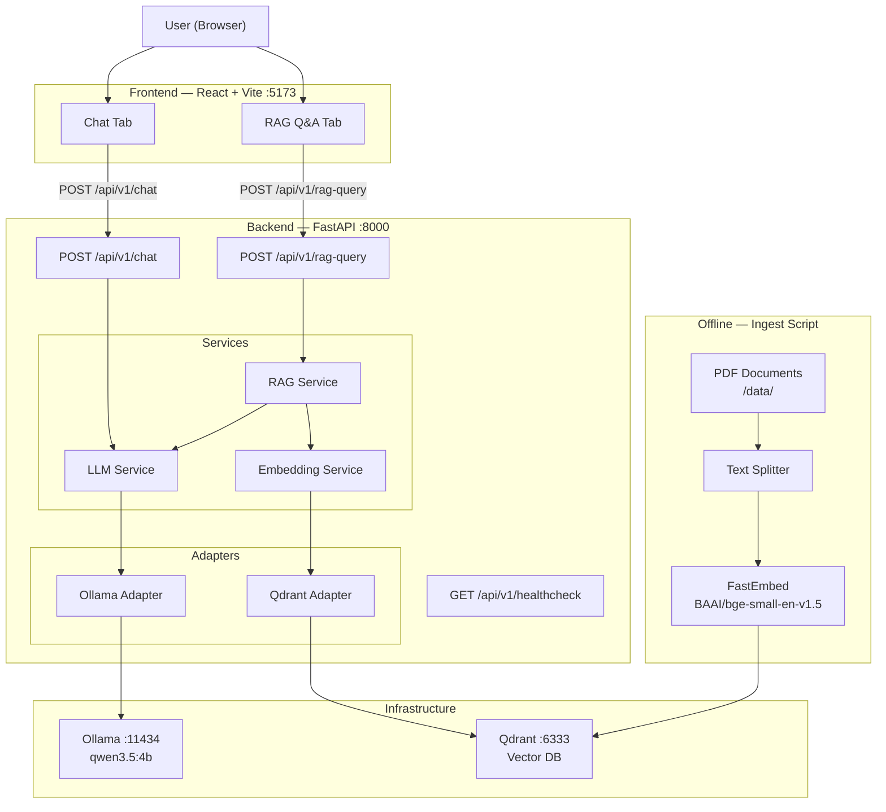

# GenAI Developer Challenge

End-to-end GenAI application with a RAG pipeline, LLM integration, and a React frontend.  
Built as a technical challenge to demonstrate GenAI development, API design, and modern ML engineering practices.

---

## Table of Contents

- [Goal](#goal)
- [Architecture](#architecture)
- [Project Structure](#project-structure)
- [Tech Stack & Justification](#tech-stack--justification)
- [Prerequisites](#prerequisites)
- [Setup & Run](#setup--run)
  - [Local Development](#local-development)
  - [Docker](#docker)
- [API Reference](#api-reference)
- [RAG Pipeline](#rag-pipeline)
- [Prompt Engineering](#prompt-engineering)
- [Configuration](#configuration)
- [Testing](#testing)
- [Cloud Deployment](#cloud-deployment)
- [GenAI Coding Assistants](#genai-coding-assistants)

---

## Goal

Build an end-to-end GenAI application that:

1. Exposes a **REST API** (FastAPI) for LLM-powered chat and document-grounded Q&A.
2. Implements a **RAG pipeline** — ingest documents, embed them, store in a vector DB, and retrieve relevant context at query time.
3. Provides a **React frontend** with separate Chat and RAG Q&A modes.
4. Runs entirely on **free/open-source** tools — local Ollama LLM, local Qdrant, open-source embeddings.

---

## Architecture



**Request flow — RAG query:**

```
User query
  → FastAPI /api/v1/rag-query
    → embed query (FastEmbed)
    → search Qdrant (top-k chunks)
    → build grounded prompt (retrieved context + query)
    → call Ollama (qwen3.5:4b)
    → return answer + sources
```

---

## Project Structure

```
Challenge/
├── backend/
│   ├── app/
│   │   ├── main.py                 # FastAPI app, CORS, lifespan
│   │   ├── core/
│   │   │   ├── config.py           # Pydantic Settings (env-driven)
│   │   │   └── logging.py          # Structured JSON logging
│   │   ├── api/
│   │   │   └── v1/
│   │   │       ├── router.py
│   │   │       └── routes/
│   │   │           ├── health.py   # GET /api/v1/healthcheck
│   │   │           ├── chat.py     # POST /api/v1/chat
│   │   │           └── rag.py      # POST /api/v1/rag-query
│   │   ├── services/
│   │   │   ├── llm_service.py      # LLM call + session memory
│   │   │   ├── rag_service.py      # Retrieve → prompt → answer
│   │   │   └── embedding_service.py
│   │   └── adapters/
│   │       ├── ollama_adapter.py   # langchain-ollama wrapper
│   │       └── qdrant_adapter.py   # qdrant-client wrapper
│   ├── scripts/
│   │   └── ingest.py               # Load PDFs → chunk → embed → store
│   ├── tests/
│   │   ├── test_health.py
│   │   ├── test_chat.py
│   │   └── test_rag.py
│   ├── Dockerfile
│   ├── pyproject.toml              # Dependencies managed with uv
│   └── .env.example
├── frontend/
│   ├── src/
│   │   ├── App.tsx                 # Tab switcher (Chat / RAG Q&A)
│   │   ├── types.ts
│   │   ├── api/client.ts           # Typed fetch wrappers (no direct LLM calls)
│   │   └── components/
│   │       ├── ConversationPane.tsx
│   │       ├── MessageBubble.tsx   # Markdown rendering, source cards
│   │       ├── SourceCard.tsx      # Collapsible source with images
│   │       └── LoadingBubble.tsx
│   ├── Dockerfile                  # Multi-stage: node build → nginx serve
│   ├── nginx.conf                  # SPA routing + static asset caching
│   ├── package.json
│   └── vite.config.ts
├── data/                           # 10 PDFs — Listado de las Aves Argentinas
├── docker-compose.yml
├── Makefile
└── README.md
```

---

## Tech Stack & Justification

| Layer | Tool | Version | Why |
|---|---|---|---|
| API framework | FastAPI | 0.136.x | Async-native, automatic OpenAPI docs, Pydantic-first |
| Runtime | Python | 3.12 | Latest stable, full type narrowing support |
| Dependency manager | uv | 0.8.x | 10–100× faster than pip, lock-file reproducibility |
| LLM runtime | Ollama | local | Zero-cost local inference, OpenAI-compatible API |
| LLM model | qwen3.5:4b | — | Strong instruction-following at 4B params, fast on CPU/Apple Silicon |
| LLM integration | langchain-ollama | 1.1.x | Thin, well-maintained wrapper; brings conversation memory |
| Embeddings | FastEmbed (`BAAI/bge-small-en-v1.5`) | 0.8.x | ~25 MB model, downloads automatically, strong retrieval quality |
| Vector DB | Qdrant | 1.17.x | Persistent, supports hybrid search & metadata filtering, first-class FastEmbed support |
| Text splitting | langchain-text-splitters | 1.1.x | Recursive character splitter with configurable overlap |
| PDF loading | PyMuPDF (`fitz`) | 1.27.x | Fast text + image extraction from PDF pages |
| Validation | Pydantic v2 | 2.13.x | Request/response models + settings management |
| Frontend | React + Vite | — | Lightweight, fast HMR, no heavyweight framework |
| Testing | pytest + pytest-asyncio | 9.x / 1.3.x | Async-native test runner |
| Linting | Ruff | 0.15.x | Replaces flake8 + isort + pyupgrade in one tool |
| Containerisation | Docker + Compose | — | One-command local stack |

---

## Prerequisites

| Tool | Install |
|---|---|
| Python 3.12+ | `uv python install 3.12` |
| [uv](https://docs.astral.sh/uv/) | `curl -LsSf https://astral.sh/uv/install.sh \| sh` |
| [Docker Desktop](https://www.docker.com/products/docker-desktop/) | Download from Docker website |
| [Ollama](https://ollama.com/) | Download from ollama.com |

Pull the required Ollama model:

```bash
ollama pull qwen3.5:4b
```

---

## Setup & Run

### Local Development

**1. Clone and enter the repo**

```bash
git clone <your-repo-url>
cd Challenge
```

**2. Start Qdrant**

```bash
make up
# or: docker compose up -d
```

**3. Install backend dependencies**

```bash
make install
# or: cd backend && uv sync
```

**4. Configure environment**

```bash
cp backend/.env.example backend/.env
# Edit backend/.env if your Ollama URL or model name differs
```

**5. Start the API**

```bash
make dev
# or: cd backend && uv run uvicorn app.main:app --reload
```

**6. Verify**

```bash
curl http://localhost:8000/api/v1/healthcheck
```

```json
{
  "status": "ok",
  "version": "0.1.0",
  "environment": "development",
  "model": "qwen3.5:4b"
}
```

**7. Ingest documents** *(after dropping PDFs into `data/`)*

```bash
make ingest
# or: cd backend && uv run python scripts/ingest.py
```

**8. Start the frontend**

```bash
make frontend-install   # first time only
make frontend-dev
# or: cd frontend && npm install && npm run dev
# Open http://localhost:5173
```

---

### Docker

Bring up the full stack (Qdrant + backend + frontend):

```bash
# First run, or after any source change:
make up-build

# Subsequent runs (images already built):
make up
```

- Frontend → http://localhost
- Backend API → http://localhost:8000

> **Note:** The frontend image bakes in `VITE_API_BASE_URL=http://localhost:8000` at build time, so the browser talks directly to the backend on your machine. Ollama must still run on the host — make sure it's running before starting the stack.

---

## API Reference

### `GET /api/v1/healthcheck`

Returns service status.

```bash
curl http://localhost:8000/api/v1/healthcheck
```

```json
{
  "status": "ok",
  "version": "0.1.0",
  "environment": "development",
  "model": "qwen3.5:4b"
}
```

---

### `POST /api/v1/chat`

Chat with the LLM directly. Supports multi-turn conversation via `session_id`.

```bash
curl -X POST http://localhost:8000/api/v1/chat \
  -H "Content-Type: application/json" \
  -d '{
    "message": "What is retrieval-augmented generation?",
    "session_id": "user-abc-123"
  }'
```

```json
{
  "reply": "Retrieval-Augmented Generation (RAG) is a technique that...",
  "session_id": "user-abc-123",
  "model": "qwen3.5:4b",
  "meta": {
    "latency_ms": 1240
  }
}
```

**Request body:**

| Field | Type | Required | Description |
|---|---|---|---|
| `message` | string | ✓ | User prompt |
| `session_id` | string | — | Groups messages into a conversation |
| `model_name` | string | — | Override the default model |

---

### `POST /api/v1/rag-query`

Ask a question grounded in your ingested documents.

```bash
curl -X POST http://localhost:8000/api/v1/rag-query \
  -H "Content-Type: application/json" \
  -d '{
    "query": "What is the national bird of Argentina?",
    "top_k": 5
  }'
```

```json
{
  "answer": "The national bird of Argentina is the Rufous Hornero (Furnarius rufus)...",
  "sources": [
    {
      "chunk_id": "abc-123",
      "source": "LISTADO DE LAS AVES ARGENTINAS-1.pdf",
      "page": 4,
      "score": 0.92,
      "text_snippet": "El Hornero (Furnarius rufus) fue declarado ave nacional...",
      "image_urls": ["/images/LISTADO_DE_LAS_AVES_ARGENTINAS-1_p4_1.jpeg"]
    }
  ],
  "meta": {
    "latency_ms": 1840,
    "hits": 5
  }
}
```

**Request body:**

| Field | Type | Required | Description |
|---|---|---|---|
| `query` | string | ✓ | User question |
| `top_k` | int | — | Number of chunks to retrieve (default: 5) |
| `source_filter` | string | — | Filter by document filename |

---

## RAG Pipeline

### Document Ingestion

Place PDF files in the `data/` directory, then run:

```bash
make ingest
```

The script (`scripts/ingest.py`):
1. Loads each PDF with **PyMuPDF** (`fitz`)
2. Extracts page text and any embedded images (images &lt; 80×80 px are skipped as decorative noise)
3. Splits text into chunks (`chunk_size=512`, `overlap=64`) using `RecursiveCharacterTextSplitter`
4. Embeds each chunk with FastEmbed (`BAAI/bge-small-en-v1.5`, ~25 MB, auto-downloaded)
5. Stores vectors + metadata in Qdrant collection `documents`

Result for the Argentine Birds corpus: **~1,743 chunks** and **146 extracted images**.

Metadata stored per chunk:

| Field | Description |
|---|---|
| `source` | Original PDF filename |
| `page` | Page number |
| `chunk_id` | Unique UUID |
| `image_filenames` | List of images extracted from that page |

### Retrieval

At query time:
1. The query is embedded with the same FastEmbed model
2. Qdrant performs a cosine similarity search and returns `top_k` chunks
3. The retrieved chunks are injected into the LLM prompt as context

---

## Prompt Engineering

### RAG System Prompt

The RAG endpoint (`app/services/rag_service.py`) uses a domain-specific grounding prompt:

```
You are a knowledgeable ornithology assistant specialising in Argentine birds.
Answer the user's question based strictly on the context provided below.
Cite the source document and page number when relevant.
If the context does not contain enough information to answer the question, say:
"I don't have enough information in the provided documents to answer this question."
Do not use prior knowledge beyond what is in the context.
```

The prompt is constructed as:
```
[System prompt above]

Context:
[Source: filename.pdf, Page N]
<chunk text>

---

[Source: filename.pdf, Page M]
<chunk text>

Question: <user query>
```

**Why this reduces hallucinations:**
- **Domain framing** ("ornithology assistant") anchors the model's role and reduces off-topic drift.
- **"Strictly on the context"** suppresses the model's tendency to fill gaps with training data.
- **Explicit citation instruction** encourages the model to reference sources, making it auditable.
- **Named fallback phrase** gives the model a safe, pre-scripted exit instead of fabricating an answer.
- **Context injected before the question** ensures the model attends to retrieved chunks first.

### Chat System Prompt

The direct chat endpoint (`app/services/llm_service.py`) uses a concise general assistant prompt:

```
You are a knowledgeable and concise assistant.
Answer questions clearly and accurately based on your training knowledge.
When you are unsure about something, say so rather than guessing.
Keep responses focused and to the point — avoid unnecessary padding.
```

Full conversation history (up to 10 turns) is passed to the model on each request, enabling multi-turn dialogue.

---

## Configuration

All configuration is driven by environment variables. Copy `.env.example` to `.env` and adjust:

```bash
cp backend/.env.example backend/.env
```

| Variable | Default | Description |
|---|---|---|
| `APP_ENV` | `development` | `development` or `production` |
| `APP_VERSION` | `0.1.0` | Reported in healthcheck |
| `OLLAMA_BASE_URL` | `http://localhost:11434` | Ollama server URL |
| `OLLAMA_MODEL` | `qwen3.5:4b` | Model name as listed by `ollama list` |
| `QDRANT_URL` | `http://localhost:6333` | Qdrant REST API URL |
| `QDRANT_COLLECTION_NAME` | `documents` | Collection to store/query embeddings |
| `EMBED_MODEL` | `BAAI/bge-small-en-v1.5` | FastEmbed model (downloaded on first run) |
| `RAG_TOP_K` | `5` | Default number of chunks to retrieve |
| `RAG_CHUNK_SIZE` | `512` | Tokens per chunk during ingestion |
| `RAG_CHUNK_OVERLAP` | `64` | Overlap between consecutive chunks |

---

## Testing

```bash
# Run all tests
make test
# or: cd backend && uv run pytest -v

# Run with coverage (coming)
cd backend && uv run pytest --cov=app -v
```

Current test coverage:

| Test | Status |
|---|---|
| `test_health.py` — healthcheck returns 200 + `status: ok` | ✓ |
| `test_chat.py` — reply shape, empty-message rejection (422), session auto-generation | ✓ |
| `test_rag.py` — answer + sources shape, empty-query rejection (422), `top_k` out-of-range (422), source filter passthrough | ✓ |

Chat and RAG tests mock the service layer so they run without a live Ollama or Qdrant instance.

---

## Cloud Deployment

### Strategy (Azure Container Apps)

The recommended deployment path uses **Azure Container Apps** (free tier available):

```bash
# 1. Build and push images
docker build -t <registry>/genai-backend:latest ./backend
docker push <registry>/genai-backend:latest

# 2. Deploy Qdrant as a Container App with persistent volume
az containerapp create \
  --name qdrant \
  --image qdrant/qdrant:v1.17.1 \
  --target-port 6333

# 3. Deploy backend
az containerapp create \
  --name genai-backend \
  --image <registry>/genai-backend:latest \
  --env-vars QDRANT_URL=<qdrant-internal-url> OLLAMA_BASE_URL=<ollama-url>
```

> For Ollama in the cloud, use a GPU-enabled VM or substitute with a free-tier cloud LLM (e.g. Hugging Face Inference API) by changing `OLLAMA_BASE_URL`.

**Deployment status:** Local only (no public URL at this stage).

---

## GenAI Coding Assistants

This project was built using **Claude Code** (Anthropic's CLI coding assistant) as the primary AI-assisted development tool.

**How it helped:**
- Scaffolding the layered FastAPI architecture (`api/`, `services/`, `adapters/`, `core/`)
- Resolving dependency version conflicts across the LangChain + Qdrant + FastEmbed ecosystem
- Generating Pydantic models, structured logging, and test boilerplate
- Verifying library versions against PyPI in real time before pinning them

**Limitations and corrections:**
- Initial dependency draft used `qdrant-client[fastembed]` which pins `fastembed<0.8`. This was caught by querying PyPI directly and resolved by using `fastembed>=0.8.0` standalone (no extra).
- The Qdrant Docker image version in the first draft was outdated (`v1.13.6`); corrected to `v1.17.1` after a live registry check.

All generated code was reviewed, tested, and adjusted before committing.
